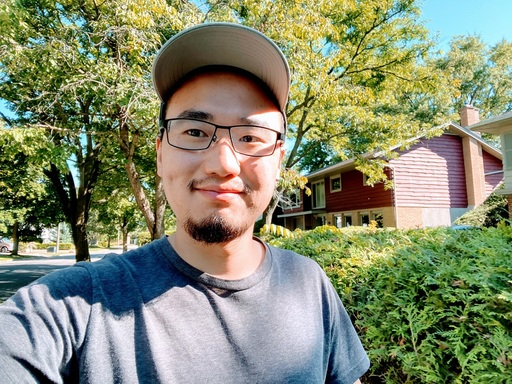

I am a PhD student in the [ComSec](https://uwaterloo.ca/communications-security-lab/) lab at University of Waterloo under the supervision of Prof. [Guang Gong](https://uwaterloo.ca/scholar/ggong). I got my MEng in Institute of Information Engineering from [Chinese Academy of Sciences](https://english.cas.cn/). I received my BS in Faculty of Mathematics from [Fudan University](https://www.fudan.edu.cn/en/).

#### - Updates

*Fall 2021*, pass the comprehensive exam II: Comprehensive PhD Proposal Examination

*Fall 2020*, pass the comprehensive exam I: Comprehensive Background Examination

#### - Email

guiwen dot luo at uwaterloo dot ca

#### - Miscellaneous

*Winter 2022*, teaching assistant in *ECE 409 - Cryptography and System Security*

*Spring 2020*, teaching assistant in *ECE 458 - Computer Security*

*Winter 2020*, volunteer in *ECE Volunteer Mentorship Program*
